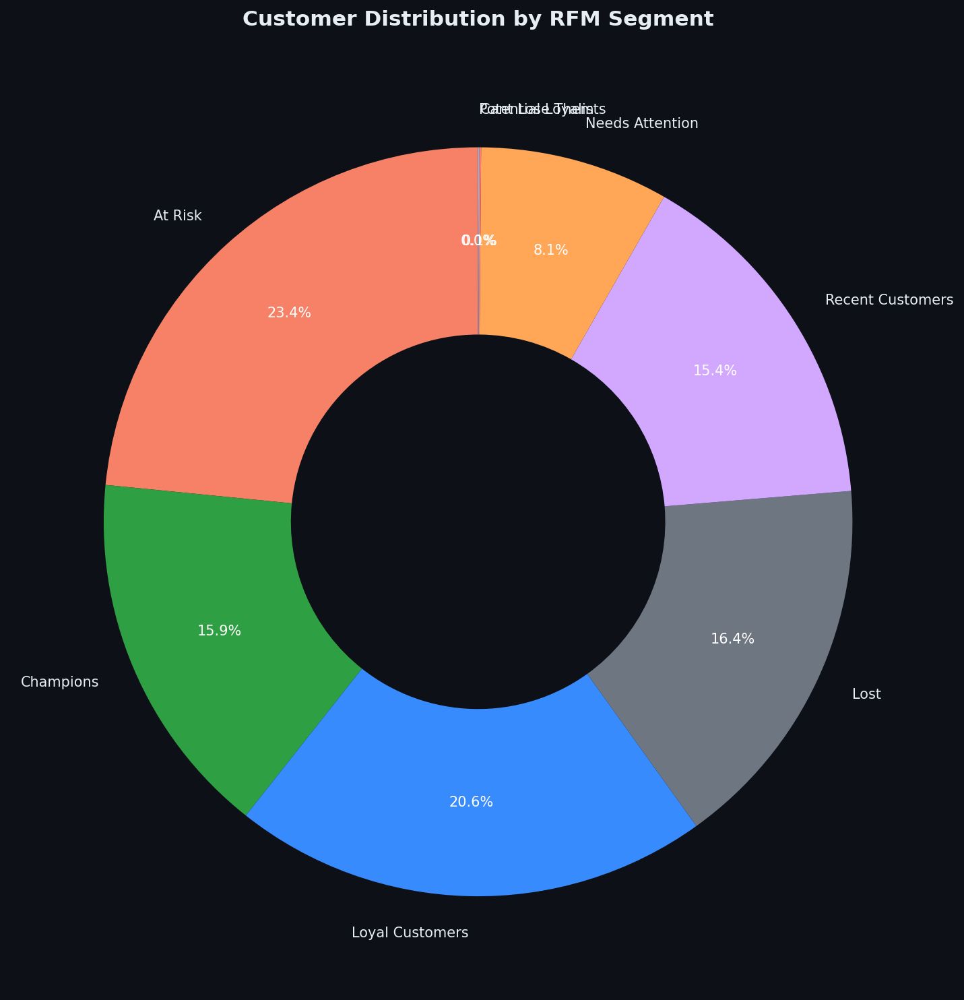
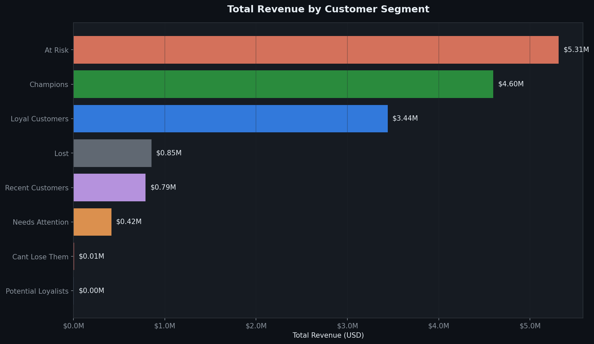
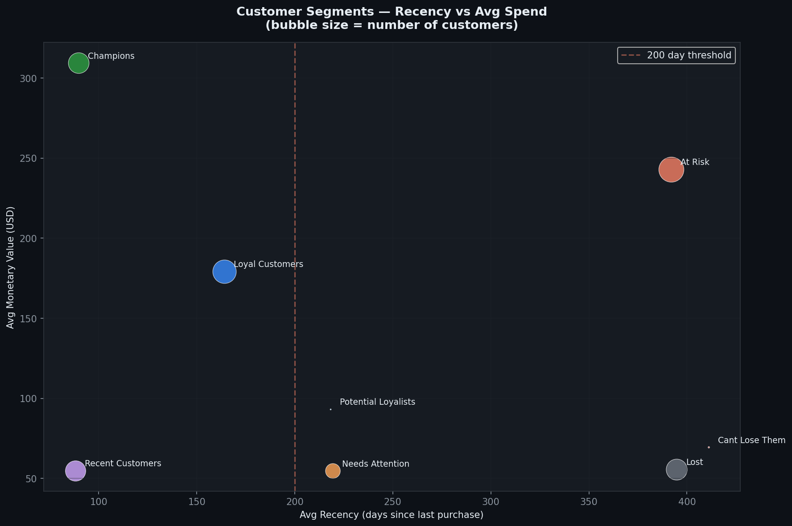
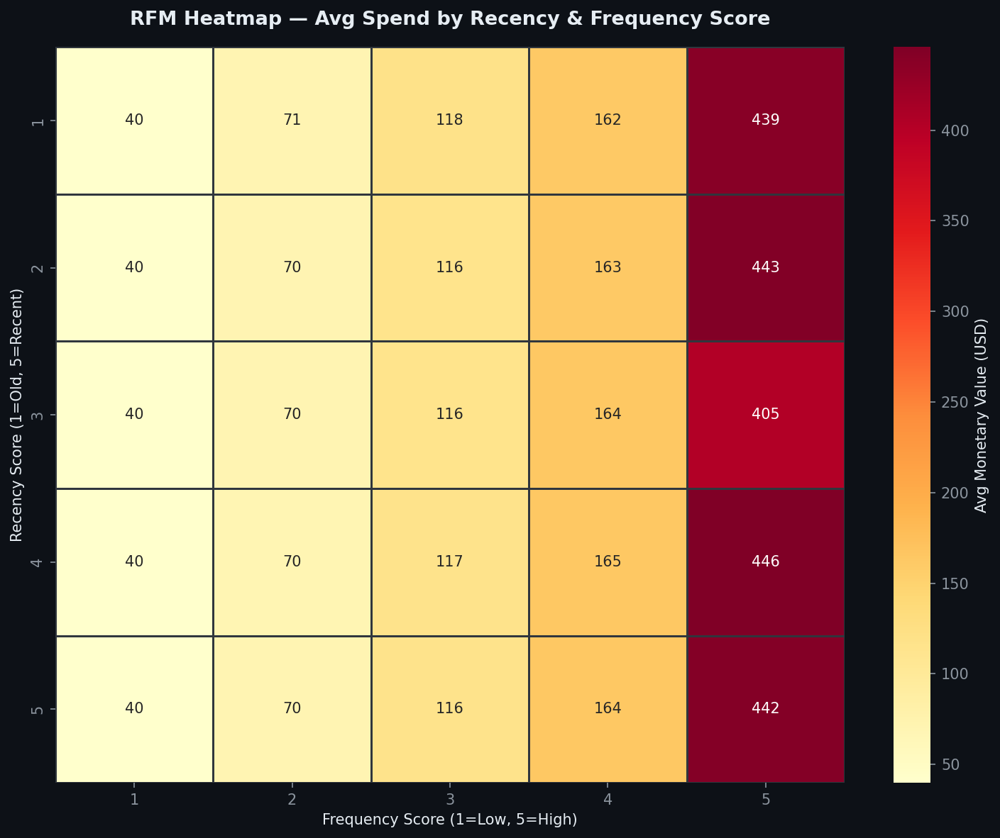
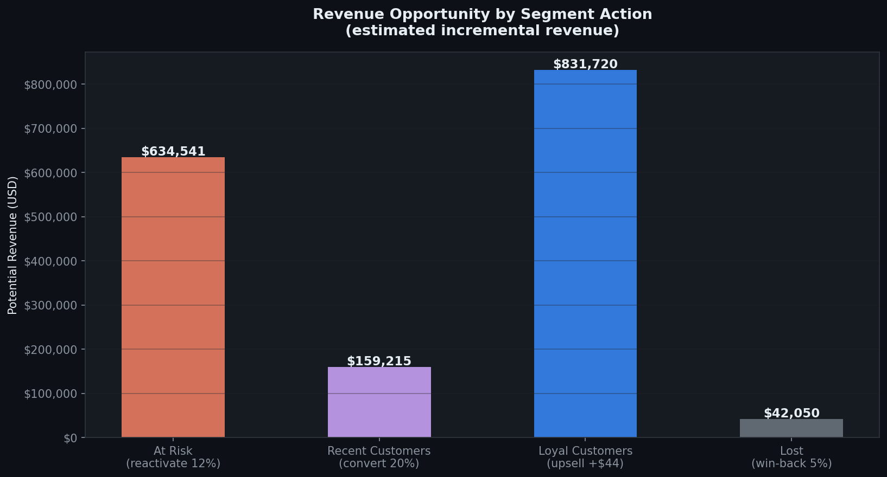

# rfm-customer-segmentation
Sales and revenue analysis of Brazilian E-Commerce dataset using SQL and Python
# RFM Customer Segmentation — Brazilian E-Commerce 🎯

## Overview
RFM (Recency, Frequency, Monetary) analysis of 93,096 customers from Olist, 
Brazil's largest e-commerce marketplace. This project segments customers into 
actionable groups to drive retention, reactivation and revenue growth strategies.

## What is RFM?
RFM is a proven marketing framework used by leading companies to segment customers:
- **Recency (R):** How recently did the customer purchase?
- **Frequency (F):** How often do they purchase?
- **Monetary (M):** How much do they spend?

Each customer receives a score from 1-5 in each dimension, enabling precise 
segmentation and targeted action.

## Dataset
- **Source:** Brazilian E-Commerce Public Dataset by Olist (Kaggle)
- **Size:** 93,096 unique customers | 96,478 delivered orders | 2016–2018
- **Tools:** PostgreSQL, Python (pandas, matplotlib, seaborn)

## Project Structure
```
├── queries/
│   └── 01_rfm_analysis.sql
├── notebooks/
│   └── rfm_analysis.ipynb
└── README.md
```

---

## Customer Segments

| Segment | Customers | % of Base | Avg Spend | Total Revenue |
|---------|-----------|-----------|-----------|---------------|
| 🔴 At Risk | 21,699 | 23.24% | $243.69 | $5,287,842 |
| 🏆 Champions | 15,174 | 16.25% | $309.31 | $4,693,458 |
| 💚 Loyal Customers | 18,900 | 20.24% | $176.14 | $3,329,108 |
| ⚫ Lost | 15,177 | 16.26% | $55.41 | $841,009 |
| 🆕 Recent Customers | 14,341 | 15.36% | $55.51 | $796,075 |
| ⚠️ Needs Attention | 7,821 | 8.38% | $57.12 | $446,696 |
| 🌱 Potential Loyalists | 164 | 0.18% | $138.05 | $22,639 |
| 🚨 Cant Lose Them | 81 | 0.09% | $69.51 | $5,630 |

## Visualizations

### 👥 Customer Distribution by Segment


### 💰 Revenue by Segment


### 🎯 Recency vs Average Spend


### 🔥 RFM Heatmap


### 💡 Revenue Opportunity by Segment


---

## Key Findings

### 🔴 Critical: $5.3M At Risk
- **At Risk is the largest revenue segment** ($5,287,842 — 33% of total)
- 21,699 customers who spent well but haven't returned in avg **392 days**
- These were good customers — avg spend $243 — now silent
- **Every month without action = permanent churn**

### 🏆 Champions Drive Disproportionate Value
- Only **16.25% of customers** but generate **$4,693,458** in revenue
- Highest avg spend at **$309 per customer**
- Purchased recently (avg 89.7 days ago) — still engaged
- Priority: keep them happy, offer VIP perks, early access to new products

### 💚 Loyal Customers — The Stable Core
- **20.24% of the base** — largest engaged segment
- Avg 164 days since last purchase — moderate recency
- Lower avg spend ($176) but consistent behavior
- Opportunity: upsell campaigns to move them toward Champions

### ⚫ Lost Customers — $841K Already Gone
- 15,177 customers averaging **394 days since last purchase**
- Very low avg spend ($55) — likely one-time bargain buyers
- Low recovery probability — not worth heavy investment
- Strategy: low-cost win-back email with strong discount only

### 🆕 Recent Customers — Convert Before They Leave
- 14,341 new customers, avg **88 days** since first purchase
- Low avg spend ($55) — still in exploration phase
- **Critical window:** next 90 days determine if they become Loyal or Lost
- Strategy: onboarding sequence, category recommendations, second purchase incentive

---

## Business Recommendations

### Priority 1 — Reactivate At Risk ($5.3M at stake)
Deploy a reactivation campaign targeting 21,699 At Risk customers:
- Personalized email with "We miss you" + 15% discount
- Highlight new arrivals in their previously purchased categories
- Expected recovery rate: 10-15% = **$528K-$793K recovered revenue**

### Priority 2 — Protect Champions
- Exclusive loyalty program for top 15,174 customers
- Early access to sales and new products
- Personal account manager for top 1% spenders

### Priority 3 — Accelerate Recent Customers
- Automated 3-email onboarding sequence after first purchase
- Product recommendations based on first purchase category
- Goal: convert 20% to Loyal Customers = **$159K incremental revenue**

### Priority 4 — Upsell Loyal Customers
- Bundle offers and cross-category promotions
- Target avg spend increase from $176 to $220
- Potential impact: **$831K additional revenue**

---


 


## Author
**Simón Segovia** | Financial & Data Analyst  
📧 [your email]  
💼 [your LinkedIn URL]  
🐙 [your GitHub URL]
